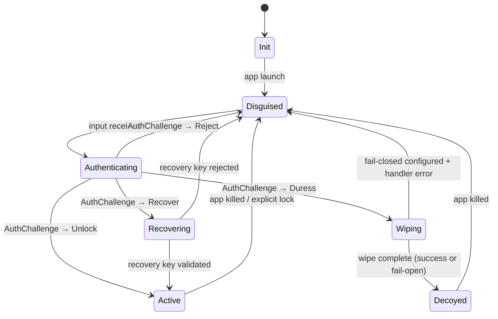

# 00 — Architecture

**Spec module:** 00 / Architecture
**Status:** draft
**Spec version this module belongs to:** 0.1.0

## Purpose

This module is the foundation of the penumbra-spec. It defines the vocabulary,
the canonical state machine, and the threat-tier model that every other module
references. Implementers `MUST` read this module before reading any other.

All normative terms (`MUST`, `SHOULD`, `MAY`, `MUST-NOT`) are used per RFC 2119.

## Terminology

The following terms are used throughout the spec. Every occurrence of a term in
backticks in any spec module refers to the definition here unless the referencing
module explicitly overrides it.

**`AuthChallenge`** — Interface every authentication method conforms to. Accepts
user input and returns exactly one of `Unlock`, `Duress`, `Reject`, or `Recover`.
The full registry of conformant `AuthChallenge` methods is defined in
`01-authentication.md`.

**`Duress`** — Return value of `AuthChallenge` signaling that the user presented
a duress credential. Receipt triggers a `DuressEvent` and transitions the state
machine to `Wiping`.

**`Decoy`** — A hardcoded fake-data UI displayed after a `DuressEvent` to satisfy
an inspector without revealing that real data ever existed. `Decoy` content `MUST`
not reference or be derivable from real user data. Credibility tiers and content
bundle protocol are defined in `03-decoy.md`.

**`Disguise`** — The visible-from-launch UI that presents the application as a
different, innocuous app (calculator, notes, weather, etc.). The `Disguise` is
active whenever the state machine is in `Disguised` or `Decoyed`. Contract and
shipped registry are defined in `02-disguise.md`.

**`DuressEvent`** — A signal emitted when an `AuthChallenge` returns `Duress`.
Receipt of a `DuressEvent` `MUST` immediately invoke the registered `WipeHandler`
chain for the configured `WipeTier`. The wipe protocol is defined in
`04-wipe-protocol.md`.

**`fail-closed`** — A `WipeHandler` failure policy that treats handler errors as
fatal: the state machine transitions to `Disguised` immediately and the failed
handler is retried at next launch. Contrast with fail-open, where handler errors
are treated as succeeded and execution continues. The per-handler policy is
declared in the `Manifest`.

**`Hard`** — A `WipeTier` value that requires multi-pass overwrite of app data,
free-space scrubbing, and remote session revocation. Defined in
`04-wipe-protocol.md`.

**`Medium`** — A `WipeTier` value that deletes all local app data and revokes
in-app session tokens. Defined in `04-wipe-protocol.md`.

**`Manifest`** — A JSON document conforming to `manifest.schema.json` that fully
configures a deployment: which `Disguise` to use, which `AuthChallenge` methods
are active, the configured `WipeTier`, registered `WipeHandler`s, the `Decoy`
content bundle, and the declared `Threat Tier`. No configuration outside the
`Manifest` is permitted in a conformant implementation.

**`Recover`** — Return value of `AuthChallenge` signaling that the user is
attempting to restore data via a `RecoveryKey`. Only valid when the configured
`WipeTier` is `Recoverable-Lock`; transitions the state machine to `Recovering`.

**`Recoverable-Lock`** — A `WipeTier` value that encrypts local app data with an
off-device `RecoveryKey` rather than destroying it, enabling authorized recovery.
Defined in `04-wipe-protocol.md`.

**`RecoveryKey`** — A key stored off-device that can re-unlock data protected by
the `Recoverable-Lock` wipe tier. The `RecoveryKey` interface is opinion-free
about key storage location. Key derivation, splitting, and delivery contracts are
defined in `04-wipe-protocol.md`.

**`Reject`** — Return value of `AuthChallenge` signaling that the presented
credential did not match any known sequence. Transitions the state machine back to
`Disguised` without logging the attempt in plaintext.

**`Soft`** — A `WipeTier` value that performs logout and token revocation without
deleting local app data. Defined in `04-wipe-protocol.md`.

**`Threat Tier`** — One of `Casual`, `Coercion`, or `Advanced`. A deployment
selects exactly one tier in its `Manifest`; that selection determines which
features are required, optional, or forbidden. The per-tier requirements are
defined in the Threat Tiers section of this module.

**`Unlock`** — The result of an `AuthChallenge` that confirms the user knows the
normal credential. An `Unlock` result transitions the state machine from
`Authenticating` to `Active`.

**`WipeHandler`** — A function registered by an embedding application to perform
a specific wipe action at a specific `WipeTier`. The embedding application `MUST`
register at least one `WipeHandler` for every tier equal to or below the
configured `WipeTier`. The full contract and failure-mode semantics are defined in
`04-wipe-protocol.md`.

**`WipeTier`** — One of `Soft`, `Medium`, `Hard`, or `Recoverable-Lock`.
Determines the set of `WipeHandler`s that execute when a `DuressEvent` is
received. Tier semantics and the ordering guarantee are defined in
`04-wipe-protocol.md`.

## State Machine

The canonical state machine governs every conformant implementation. A conformant
implementation `MUST` implement all states and `MUST` not introduce transitions
not listed in the Transition Contract below.

### Init

`Init` is the transient state entered at process start, before any UI is rendered.
The implementation `MUST` read the `Manifest`, validate it against
`manifest.schema.json`, and initialize all registered `WipeHandler`s during this
state. If `Manifest` validation fails, the implementation `MUST` transition to
`Disguised` and `MUST-NOT` surface a diagnostic UI that could reveal the
application's true nature. `Init` has no user-visible representation.

### Disguised

`Disguised` is the default visible state. The `Disguise` UI is active and the
application presents as the configured decoy app type (calculator, notes, etc.).
The implementation `MUST` accept user input in `Disguised` in a way that is
visually consistent with the disguise, and `MUST` route that input through the
`AuthChallenge` chain. No unlock credential `MUST` be stored in memory when the
state machine is in `Disguised`.

### Authenticating

`Authenticating` is entered when the implementation detects that accumulated input
matches the shape expected by the active `AuthChallenge`. The implementation
`MUST` complete the `AuthChallenge` evaluation — including its mandatory
300–600 ms timing window — before emitting a result. The timing window `MUST` be
applied uniformly across all outcomes (`Unlock`, `Duress`, `Reject`, `Recover`) so
that response latency does not reveal which branch was taken. `Authenticating` has
no distinct user-visible representation beyond the `Disguise` UI already shown.

### Active

`Active` is the state in which the real application UI is available. The
implementation `MUST` transition out of `Active` and into `Disguised` whenever the
application is backgrounded, killed, or explicitly locked by the user. There is no
persistent `Active` state across process restarts: an implementation `MUST-NOT`
cache unlock state to disk, to the OS keychain, or to any storage that survives a
process restart. This invariant ensures that a device seized and re-launched by
an adversary always starts from `Disguised`, not `Active`.

### Wiping

`Wiping` is entered when an `AuthChallenge` returns `Duress`. The implementation
`MUST` invoke every registered `WipeHandler` for the configured `WipeTier` in
tier-ascending order (lowest tier first). The `Disguise` UI `MUST` remain visible
to an observer during `Wiping`; no progress indicator, spinner, or error dialog
`MUST` be shown that could reveal wipe activity. On completion — whether all
handlers succeed or the fail-open policy applies — the state machine transitions
to `Decoyed`.

### Decoyed

`Decoyed` is entered after `Wiping` completes. The `Decoy` UI is displayed in
place of the `Disguise`. The `Decoy` `MUST` be fully functional with respect to
its configured credibility tier (see `03-decoy.md`): it `MUST` respond to
interaction, display plausible content, and `MUST-NOT` expose any reference to
real user data. The `Decoyed` state persists until the application process is
killed; on the next launch the state machine begins at `Init` and proceeds to
`Disguised`.

### Recovering

`Recovering` is entered when an `AuthChallenge` returns `Recover` and the
configured `WipeTier` is `Recoverable-Lock`. The implementation `MUST` prompt for
a `RecoveryKey` using a UI that is consistent with the `Disguise`. If the
`RecoveryKey` validates, the state machine transitions to `Active` and recovered
data is made available. If the `RecoveryKey` is invalid, the implementation
`MUST` apply rate-limiting before returning to `Disguised`. An implementation
`MUST-NOT` allow the `Recover` path if `Recoverable-Lock` is not the configured
`WipeTier`.

### Transition Contract

The following table defines every permitted state transition. An implementation
`MUST-NOT` perform a transition not listed here.

| From | Event | Guard | To | Side effects |
|---|---|---|---|---|
| `Disguised` | input received | input matches some `AuthChallenge` shape | `Authenticating` | start 300–600 ms timer (timing-attack defense) |
| `Authenticating` | challenge returns `Unlock` | tier-specific feature checks pass | `Active` | reveal Active UI; emit `audit.unlock` if configured |
| `Authenticating` | challenge returns `Duress` | always | `Wiping` | emit `DuressEvent`; invoke registered `WipeHandler`s in tier order |
| `Authenticating` | challenge returns `Reject` | always | `Disguised` | reset `AuthChallenge` state; do not log attempts in plaintext |
| `Authenticating` | challenge returns `Recover` | only if `Recoverable-Lock` tier configured | `Recovering` | prompt for `RecoveryKey` |
| `Wiping` | all handlers complete | always | `Decoyed` | display configured `Decoy` |
| `Wiping` | handler error AND fail-closed configured | configured failure policy = `fail-closed` | `Disguised` | retry handler at next launch |
| `Recovering` | `RecoveryKey` validates | always | `Active` | merge recovered data; resume normal operation |
| `Recovering` | `RecoveryKey` invalid | attempt count < N | `Disguised` | rate-limit |
| `Active` | app killed | always | `Disguised` | wipe in-memory unlock state |

### Failure-Mode Transitions

**Battery dies during `Wiping`.** If the device loses power while the state
machine is in `Wiping`, the implementation `MUST` record a persistent encrypted
flag indicating that a wipe was in progress. On the next launch, `Init` `MUST`
detect this flag and resume the `WipeHandler` chain from the last unconfirmed
handler before proceeding to `Disguised`. The wipe-resume protocol is defined in
`04-wipe-protocol.md`. Until wipe completion is confirmed, the implementation
`MUST-NOT` transition to `Active`.

**Storage failure during `Wiping`.** If a `WipeHandler` encounters a storage
error, the fail-open vs. fail-closed policy for that handler governs the outcome.
Under a fail-open policy, the implementation treats the handler as succeeded and
continues to the next handler; after all handlers complete or are skipped, the
state machine transitions to `Decoyed` as normal. Under a fail-closed policy, the
implementation transitions to `Disguised` immediately and schedules a retry of the
failed handler at next launch. The per-handler failure policy is declared in the
`Manifest` and detailed in `04-wipe-protocol.md`.

**`Disguise` process crashes.** If the process hosting the `Disguise` UI
terminates unexpectedly, the OS crash handler `MUST-NOT` display a stack trace,
crash dialog, or any UI element that would reveal that the app is not a genuine
instance of the disguised app type. Implementations `MUST` configure a catch-all
crash handler that falls through to the OS default for the app category (e.g., a
silent exit for a calculator). Any crash-diagnostic data `MUST` be suppressed or
routed to an in-process encrypted log, never to a system crash reporter.

## Threat Tiers

A deployment selects exactly one `Threat Tier` in its `Manifest`. The selected
tier determines which features are normatively required, optional, or forbidden
for that deployment. Implementers `MUST` enforce the requirements of the selected
tier and `MUST` document the tier selection prominently in any public release.

The three tiers are ordered by adversary capability: `Casual` < `Coercion` <
`Advanced`. A deployment at a higher tier satisfies all requirements of every
lower tier unless a lower-tier feature is explicitly forbidden at the higher tier.

### Casual

The `Casual` tier addresses curious observers without forensic capability:
roommates, partners, children, or anyone who picks up an unlocked device. The
attacker can see the screen, open apps, and scroll through content, but cannot
extract data from storage, observe network traffic, or perform cryptographic
analysis.

At the `Casual` tier, a conformant deployment `MUST` provide a `Disguise` that is
visually indistinguishable from a real instance of the disguised app type, and
`MUST` require a numeric or sequence-based `AuthChallenge` to reach `Active`. A
`DuressEvent` path and `Wiping` are `MAY` features at this tier; deployments that
target only casual observers may omit them. No feature is forbidden at `Casual`.

### Coercion

The `Coercion` tier addresses an adversary who is physically present and demanding
access: a border agent, a hostile checkpoint, or an abusive partner. The attacker
can observe the user's actions, physically compel input, and potentially seize the
device. The adversary may have seconds to minutes to inspect the device and is
unlikely to have forensic equipment on-site.

At the `Coercion` tier, a conformant deployment `MUST` provide all `Casual`
features plus: a `DuressEvent` path that triggers `Wiping`, and timing-attack
defense ensuring every `AuthChallenge` evaluation takes between 300 ms and 600 ms
regardless of outcome. Biometric `AuthChallenge` methods (fingerprint, face
recognition) `MUST-NOT` be used as the sole authentication factor at this tier,
because biometrics can be physically compelled without knowledge of a credential.
Biometrics `MUST-NOT` be the only active `AuthChallenge` configured in the
`Manifest` when `Threat Tier` is `Coercion` or `Advanced`.

### Advanced

The `Advanced` tier addresses a sophisticated adversary with forensic capability:
a nation-state actor, law enforcement with imaging equipment, or a well-resourced
attacker who can extract raw flash storage, attach debuggers, or perform
side-channel analysis.

At the `Advanced` tier, a conformant deployment `MUST` provide all `Coercion`
features plus: hardware-backed PIN derivation using the platform secure element
(iOS Secure Enclave or Android Keystore), and the `Hard` `WipeTier` including
multi-pass overwrite and free-space scrubbing. Anti-tampering detection (rooted
device, attached debugger, screen-recording) is `MUST` at this tier; the full
detection contract is defined in `07-anti-tampering.md` (v0.2). An `Advanced`-tier
deployment `MUST-NOT` rely solely on app-layer obfuscation and `MUST` declare its
known limits per `09-threat-model.md`.

### Per-Tier Feature Matrix

The following table summarizes the normative requirements for each feature at each
`Threat Tier`. `MUST` = required for conformance. `MAY` = permitted but not
required. `MUST-NOT` = forbidden in a conformant deployment at this tier.
`MUST-NOT-CLAIM` = the implementation `MUST-NOT` declare support for this feature
in its conformance manifest.

| Feature | Casual | Coercion | Advanced |
|---|---|---|---|
| `Disguise` | `MUST` | `MUST` | `MUST` |
| Numeric/sequence `AuthChallenge` | `MUST` | `MUST` | `MUST` |
| Biometric `AuthChallenge` | `MAY` | `MUST-NOT` | `MUST-NOT` |
| `DuressEvent` + `Wiping` | `MAY` | `MUST` | `MUST` |
| Timing-attack defense (300–600 ms) | `MAY` | `MUST` | `MUST` |
| Hardware-backed PIN derivation | `MAY` | `MAY` | `MUST` |
| `Hard` tier `WipeHandler` | `MAY` | `MAY` | `MUST` |
| Anti-tampering detection (v0.2) | `MAY` | `MAY` | `MUST` |
| Recovery key | `MAY` | `MAY` | `MAY` |
